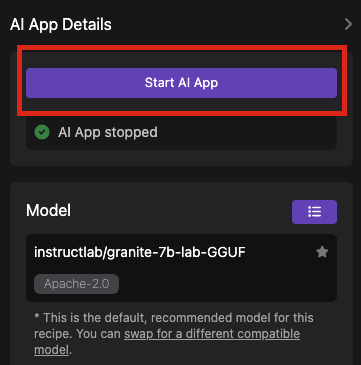

# Deploying Locally

This document is intended for users who wish to deploy their application locally. This was generated from a software template and information regarding image building and deployment are found below. 

## Quick Links

- [Prerequisites](#prerequisite)

- [Building and Pushing Images](#building-and-pushing-image-manually)

- [Deployment](#deploying-to-podman-desktop-ai-lab)

- [Cleanup](#cleanup)

- [Troubleshooting](#troubleshooting)

## Prerequisite

Deploying locally via Podman Desktop is done with the assistance of the `AI Lab Extension`. Please ensure you have the following downloaded and installed:
- [Podman Desktop 1.8.0+](https://github.com/containers/podman-desktop)
- [Podman 4.9.0+](https://podman.io/)
- [Podman Desktop AI Extension](https://github.com/containers/podman-desktop-extension-ai-lab?tab=readme-ov-file#installation)

## Building and Pushing Image Manually

You have chosen `${{ values.imageRegistry }}` as your desired image registry. Please ensure you are logged in and can read/write images from that repository. For example using `quay.io` you can run this command to prompt the entering of credentials:
```
podman login quay.io
```

To rebuild images you can run the following command from the root of the repository:
```
bash deployment/build_and_push.sh <absolute path to docker/containerfile>
```

This script requries you to provide the absolute path to your docker/containerfile as an argument. The script will perform both the building of the image as well as pushing it to the registry location you specified as part of the developer hub setup for this application. You can view the templated values in `build_and_push.sh`.

## Deploying To Podman Desktop AI Lab

Deploying via the `AI Lab` extension requires adding the generated `user-catalog.json` file to the Podman Desktops `extensions-storage`. In the [official documentation](https://github.com/containers/podman-desktop-extension-ai-lab?tab=readme-ov-file#-providing-a-custom-catalog) for the extension the default and most common install location is `$HOME/.local/share/containers/podman-desktop/extensions-storage/redhat.ai-lab`. If you altered the location please take note of the path to your `extensions-storage`.

A `deploy.sh` script was generated as part of the template that is designed to assist you in properly setting up your application to run through `Podman Desktop AI Lab`. 

You can utilize this script by running the following from the root of the source repository:
```
bash deployment/deploy.sh <extension storage path>
```
Or from the `deployment` directory itself:
```
bash deploy.sh <extension storage path>
```

Example:
```
bash deployment/deploy.sh $HOME/.local/share/containers/podman-desktop/extensions-storage/redhat.ai-lab
```

Once `deploy.sh` has successfully completed, you can navigate to your `Podman Desktop` application and open the `AI Lab` extension:


You will see your application in a category called `Local Development`:


After clicking on your new application you can run `Start AI App` to launch your application:



## Cleanup

There is additional information regarding cleaning up resources used by the extension [here](https://github.com/containers/podman-desktop-extension-ai-lab?tab=readme-ov-file#usage).

## Troubleshooting

More information regarding running applications through `Podman Desktop` and the `AI Lab` extension can be found [here](https://github.com/containers/podman-desktop-extension-ai-lab?tab=readme-ov-file#usage).